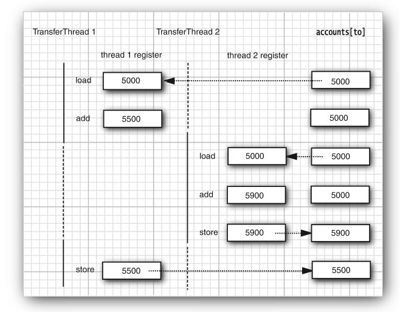
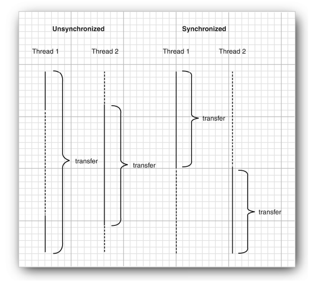
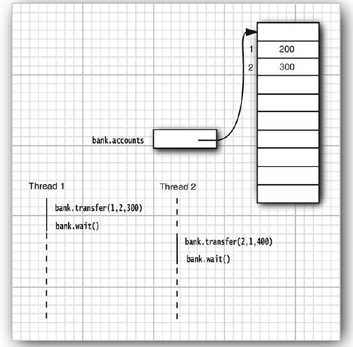

# ESEMPIO BANCA

Nel package [unsynch](./src/main/java/unsynch) c'è la versione non sincronizzata in cui si vede che si verifica la race condition.

## Sincronizzazione

Nel package [synch](./src/main/java/synch) c'è la versione che utilizza 
`java.util.concurrent.locks.Lock` e `java.util.concurrent.locks.Condition`.

Nel package [synch2](./src/main/java/synch2) c'è la versione che utilizza `synchronized`, `wait` e `notifyAll`.

## Deadlock

Lock e condizioni non possono risolvere tutti i problemi che si possono 
verificare in applicazioni multithread.

Consideriamo la segente condizione:

1. Account 1: $200
2. Account 2: $300
3. Thread 1: trasferire $300 da Account 1 a Account 2
4. Thread 2: trasferire $400 da Account 2 a Account 1

Come la figura sotto mostra, Thread 1 e Thread 2 sono bloccati. Nessuno dei due thread può procedere perché 
la disponibilità sul conto degli Account 1 e Account 2 non sono sufficienti.

E' possibile che tutti i thread siano bloccati perché ognuno sta aspettando più soldi. Questa situazione è chiamata
_deadlock_.

Esempio di deadlock:

[deadlock.DeadlockBankTest](./src/main/java/deadlock/DeadlockBankTest.java)
